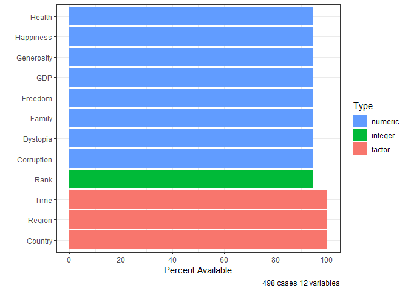

<!-- README.md is generated from README.Rmd. Please edit that file -->

# rPackageTutorial

<!-- badges: start -->

[](https://github.com/linzhengmix/rPackageTutorial/actions/workflows/R-CMD-check.yaml)
[](https://app.codecov.io/gh/linzhengmix/rPackageTutorial)
<!-- badges: end -->

The goal of rPackageTutorial is to show an example of how to create a r
package in a professional way

## Installation

You can install the development version of rPackageTutorial from
[GitHub](https://github.com/) with:

``` r
# install.packages("pak")
pak::pak("linzhengmix/rPackageTutorial")
```

## Example

This is a basic example which shows you how to solve a common problem:

``` r
library(rPackageTutorial)
data("happiness")
df_info <- contents(happiness)
plot(df_info)
```


